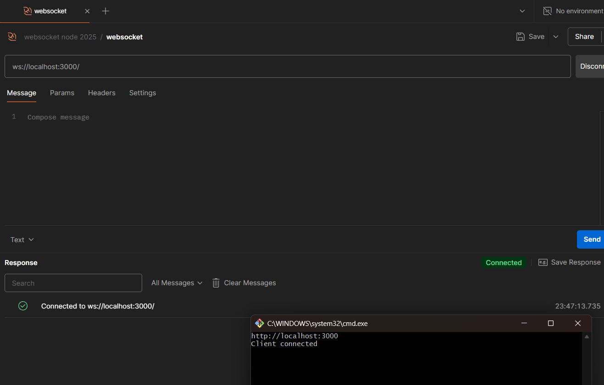
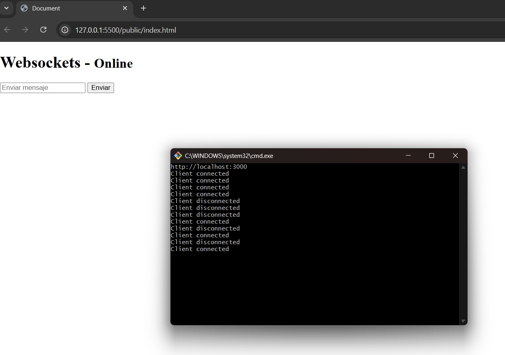
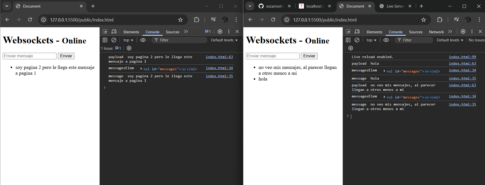
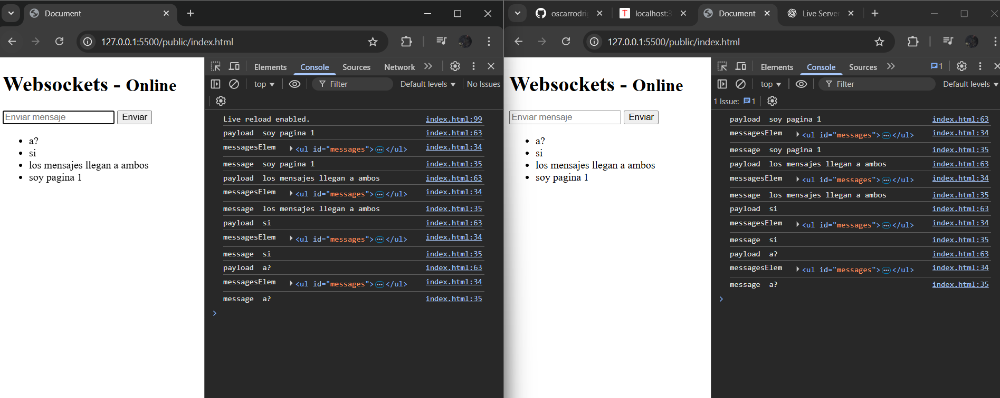

# Proyecto
websockets Es una comunicacion bilateral del cliente y el servidor, en este caso el proyecto si desarrolla para hacer un broadcast excluyente e incluyente como si fuera una especie de chat entre dos o mas instancias del navegador web.

## Instrucciones

1. Correr con `npm run dev`
2. En postman usar la url para conectar con el ws `ws://localhost:3000/`
3. Abrir el index html con el live server en el puerto 5500 que provee una extension muy popolar de visual studio code
4. Cada vez que se recarga ese navegador, en la consola aparece conncected o desconnected
5. Abrir una o mas instancias del navegador para ver en su totalidad la comunicacion del websocket
  
## Screenshots

